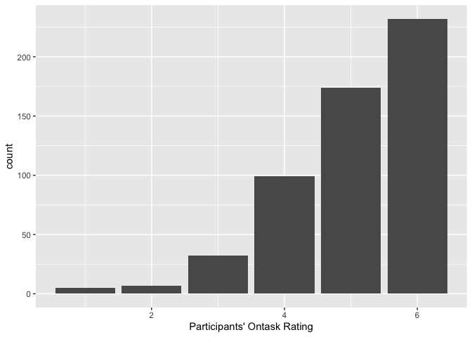
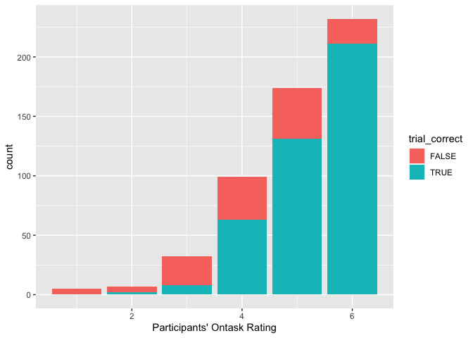
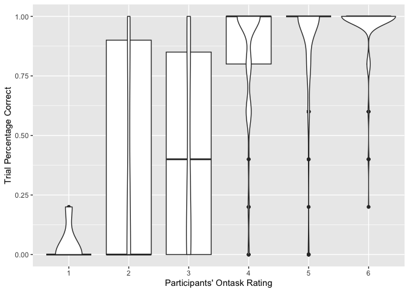
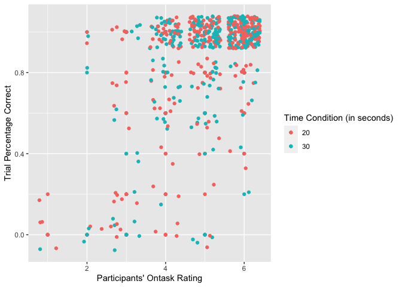
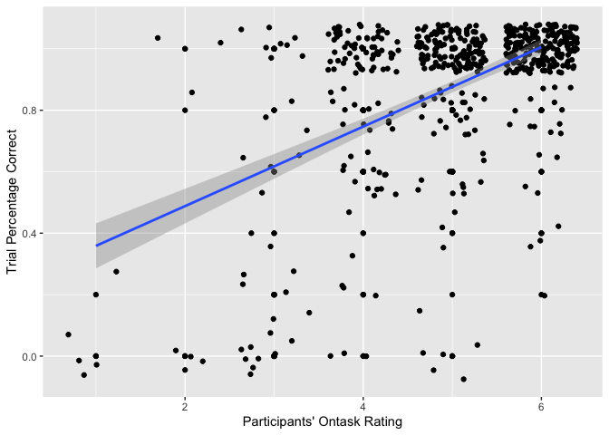
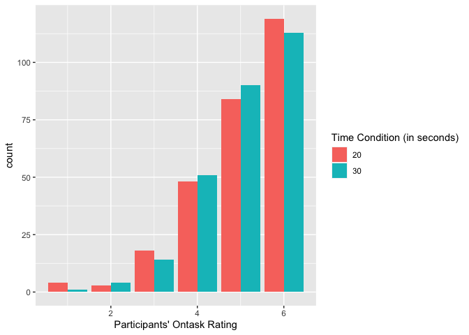

Part2: Thought Probe Analysis
================
2023-04-23

#### A bit of exploratory analysis of the thought probe data from Kassandra’s first 20 participants.

##### Goal: to judge if participants’ performance errors occur because of off-task episodes and if off-task episodes correspond to performance errors.

``` r
data <- read.csv('first_participants_probes.csv')
data <- data[,-1]
head(data)
```

    ##   participant time_condition trial_score probe1 probe2
    ## 1           1             30           1      6 ['B1']
    ## 2           1             20           1      6 ['B1']
    ## 3           1             20           1      6 ['B1']
    ## 4           1             30           1      6 ['B1']
    ## 5           1             30           1      6 ['B1']
    ## 6           1             20           1      6 ['B1']

## Probe 1: Participants Self-Rating of Ontask Level (Scale of 1-6)

### 1. What does the distribution of participant ratings look like?

``` r
#Read in data 
data <- read.csv('first_participants_probes.csv')
library(ggplot2)
data$probe1 <- as.integer(data$probe1)
ggplot(data=data, aes(x=probe1)) + geom_bar() + xlab("Participants' Ontask Rating")
```

<!-- -->
Overall, participants tend to report high levels of on-task-ed-ness
(which makes sense, participants usually try to do their best on the
task). So now, let’s see how often they remember the correct sequence of
letters based on their on-task rating.

``` r
data$trial_correct <- ifelse(data$trial_score == 1.0, TRUE, FALSE)
ggplot(data=data, aes(x=probe1, fill=trial_correct)) + geom_bar() + xlab("Participants' Ontask Rating")
```

<!-- -->
It seems that, a small fraction of the time, participants make mistakes
even when they are fully focused. Conversely, sometimes participants
complete the trial correctly even when they admit to being somewhat
distracted during the trial. This is especially notable for ratings of
“4” and seems to hint that participants are able to be a bit unfocused
and still complete the trial without (letter) errors.

But of course, the above bar plot only shows a binary measure. To
explore trial performance as a continuous measure, see the plots below.

``` r
data$probe1 <- as.character(data$probe1)
ggplot(data, aes(y=trial_score, x=probe1)) + geom_boxplot() + geom_violin() + xlab("Participants' Ontask Rating") + ylab("Trial Percentage Correct")
```

<!-- -->

``` r
data$probe1 <- as.integer(data$probe1)
ggplot(data, aes(y=trial_score, x=probe1, color = as.character(time_condition))) + geom_point() + geom_jitter() + xlab("Participants' Ontask Rating") + ylab("Trial Percentage Correct") + labs(color = "Time Condition (in seconds)")
```

<!-- -->

``` r
linreg <- lm(probe1~trial_correct, data=data)
summary(linreg)
```

    ## 
    ## Call:
    ## lm(formula = probe1 ~ trial_correct, data = data)
    ## 
    ## Residuals:
    ##     Min      1Q  Median      3Q     Max 
    ## -3.3036 -0.3036  0.6964  0.6964  1.7313 
    ## 
    ## Coefficients:
    ##                   Estimate Std. Error t value Pr(>|t|)    
    ## (Intercept)        4.26866    0.08193   52.10   <2e-16 ***
    ## trial_correctTRUE  1.03496    0.09424   10.98   <2e-16 ***
    ## ---
    ## Signif. codes:  0 '***' 0.001 '**' 0.01 '*' 0.05 '.' 0.1 ' ' 1
    ## 
    ## Residual standard error: 0.9485 on 547 degrees of freedom
    ## Multiple R-squared:  0.1807, Adjusted R-squared:  0.1792 
    ## F-statistic: 120.6 on 1 and 547 DF,  p-value: < 2.2e-16

``` r
ggplot(data, aes(y=trial_score, x=probe1)) + geom_point() + geom_jitter() + xlab("Participants' Ontask Rating") + ylab("Trial Percentage Correct") +  stat_smooth(method="lm")
```

    ## `geom_smooth()` using formula = 'y ~ x'

<!-- -->

There’s clearly not a strong linear relationship (note the very small R
squared value)… perhaps a psychometric curve would fit the data better?

### 2. How does trial duration relate to ontask rating?

Do participants report lower on-task ratings during the longer (30
second) time condition?

``` r
ggplot(data=data, aes(x=probe1, fill=as.character(time_condition))) + geom_bar(position="dodge") + xlab("Participants' Ontask Rating") + labs(fill = "Time Condition (in seconds)")
```

<!-- -->
There doesn’t seem to be much difference in ratings by time condition.

The “4” on-task rating is especially intersting to me because there’s so
much variability in performance. Perhaps that’s due to time condition:
maybe participants are more likely to complete the trial successfully in
longer trials even if they get distracted because there’s more
opportunities for rehearsal?

``` r
correct_four <- data$probe1 == 4 & data$trial_score == 1
length(data$time_condition[correct_four == TRUE & data$time_condition == 20]) #number of correct trials for 20-second durations in which participants selected "4" on the thought probe scale
```

    ## [1] 29

``` r
length(data$time_condition[correct_four == TRUE & data$time_condition == 30]) #number of correct trials for 30-second durations in which participants selected "4" on the thought probe scale
```

    ## [1] 34

Participants select “4” and complete the task correctly slightly more
often in the 30-second duration trial.

``` r
incorrect_four <- data$probe1 == 4 & data$trial_score != 1
length(data$time_condition[incorrect_four == TRUE & data$time_condition == 20]) #number of incorrect trials for 20-second durations in which participants selected "4" on the thought probe scale
```

    ## [1] 19

``` r
length(data$time_condition[incorrect_four == TRUE & data$time_condition == 30]) #number of incorrect trials for 30-second durations in which participants selected "4" on the thought probe scale
```

    ## [1] 17

Time condition doesn’t seem to make much of a difference.

### Conclusions: participants are sometimes are able to do the task correctly even when they are a little distracted. But this may vary from participant to participant. Further exploration of participants’ individual data is needed.
